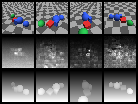
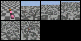

# atlas-repro

An open reproduction of **Atlas**, the world model [World Labs](https://www.worldlabs.ai)
(Fei-Fei Li, Justin Johnson, Christoph Lassner, Ben Mildenhall) announced on
1 September 2026.

Atlas is described as an *omni* world model: a single multimodal
autoregressive diffusion transformer, pretrained from scratch on text, images,
video and 3D, whose inputs are all grounded in 3D to form a **spatial
context**. Every image enters the sequence anchored at a position in space,
carrying an explicit camera pose. From that one model come camera-controlled
generation, 3D reconstruction, and spatio-temporal simulation.

This repository reproduces **that architecture** — not its scale. It trains on
a laptop CPU in about half an hour, on procedurally rendered scenes with exact
ground-truth geometry, and it does all three tasks with one set of weights.

> Atlas is closed: there is no public checkpoint, no paper and no training
> code. Everything here is reconstructed from World Labs' public description
> of the system. Where a detail is not public, this README says so and states
> what was chosen instead.

---

## The idea in one page

A conventional pipeline treats "generate a novel view", "estimate depth" and
"generate a video" as three models. Atlas treats them as one sequence problem
with different things missing.

The sequence — the spatial context — is an ordered list of **elements**:

```
[ caption ]  [ image@pose₀ ]  [ depth@pose₀ ]  [ image@pose₁ ]  [ depth@pose₁ ]  …
```

Two rules govern it:

1. **Autoregressive across elements.** Element *k* attends to elements ≤ *k*.
2. **Diffusive within an element.** An image or depth element's tokens attend
   to each other bidirectionally and are produced by *rectified flow* — the
   model regresses the velocity of the straight path from noise to data. Text
   elements are causal within themselves and predicted as categorical logits.

That combination is the "autoregressive diffusion transformer": a language
model's element-by-element factorisation, with a diffusion model's continuous
head where the data is continuous.

The 3D grounding is not a side channel. Every visual token's camera pose is
converted to a **Plücker ray** `(d, o × d)` at that token's patch centre and
added to its embedding. A token does not merely know *which patch* it is — it
knows *which line through space* it looks along. Plücker coordinates are the
right encoding because the moment `o × d` is invariant to sliding the origin
along the ray, so it encodes the line rather than an arbitrary camera centre.

The last piece is what makes one model do three jobs. **Every element carries
its own diffusion timestep.** Observed elements sit at `t = 1` (clean);
generated ones are noised independently. Nothing in the architecture
distinguishes a task — only which elements are observed:

| Task | Observed | Noised |
|---|---|---|
| Text → world | caption | all images, all depth |
| Camera-controlled generation | caption, first *k* images | remaining images + depth |
| 3D reconstruction | caption, **all** images | depth only |
| Video rollout | everything generated so far | the next frame |

Because depth lives in the same context as RGB, unprojecting it yields a
*fused* point cloud across views with no separate alignment step — and those
points, given a scale and an opacity, are a 3D Gaussian splat. Both are
exported as PLY.

---

## Quickstart

```bash
pip install torch                 # CPU wheel is fine
python -m pytest tests -q         # 95 tests, ~4s

# train the CPU-scale model (~35 min on 4 cores)
python -m atlas.train --config configs/tiny.json

# score it on held-out scenes: reconstruction + novel-view synthesis
python -m atlas.eval --ckpt runs/atlas-tiny/checkpoint.pt --scenes 32

# generate a world from text and fly a camera through it
python -m atlas.sample --ckpt runs/atlas-tiny/checkpoint.pt \
    --prompt "a scene with two red spheres and one blue cube on the floor" \
    --views 8 --out samples/text2world

# or condition on a real posed view and continue the trajectory
python -m atlas.sample --ckpt runs/atlas-tiny/checkpoint.pt --scene 7 --observed 1

# reconstruct 3D from posed images, with a depth comparison against truth
python -m atlas.reconstruct --ckpt runs/atlas-tiny/checkpoint.pt --scene 3
```

`atlas.sample` writes the views as PNGs, an inverse-depth visualisation, and
both `world.ply` (point cloud) and `world_splat.ply` (Gaussian splat, in the
layout web splat viewers expect).

---

## Results

Numbers below are from `configs/tiny.json` — 4.2M parameters, 32×32, 3000
steps on one CPU — evaluated on 32 scenes the model never saw (a disjoint
dataset seed). They exist to show the pipeline works end to end and that the
spatial context is doing something, **not** to compare against Atlas: a model
this size on scenes this simple is three orders of magnitude away, and the
data is a different distribution entirely.

`abs_rel` is scale-aligned mean absolute relative depth error (lower is
better); `delta_1.25` is the fraction of pixels within a 1.25× ratio of the
truth (higher is better); `nvs/psnr` is PSNR of views generated at held-out
poses given two observed views.

| | model | trivial baseline |
|---|---|---|
| `recon/abs_rel` ↓ | **0.130** | 0.363 *(best constant depth)* |
| `recon/delta_1.25` ↑ | **0.810** | — |
| `recon/delta_1.25²` ↑ | **0.959** | — |
| `nvs/psnr` (dB) ↑ | **12.83** | 11.89 *(copy observed view)* |

Training: 3000 steps, batch 8, ~31 minutes on 4 CPU cores. Loss 1.75 → 0.236;
the depth term fell 0.885 → 0.0085.

**Reconstruction works.** 0.130 against a 0.363 constant-depth bound is a
2.8× improvement, and 81% of pixels land within 1.25× of the truth. It holds
up qualitatively — predicted depth resolves the individual objects and their
ordering, not just the floor gradient:



*Top: input views. Middle: predicted depth. Bottom: ground truth.*

**Generation is weak at this scale**, and it would be dishonest to present it
otherwise. 12.83 dB beats copying the observed view by less than 1 dB, and
the samples show it: the model learns floor texture and colour statistics but
does not place coherent objects at held-out poses.



*Leftmost is the real conditioning view; the rest are generated.*

That gap is the expected shape of the result rather than a surprise.
Reconstruction is largely a geometric inference from pixels the model can
see, which a 4.2M-parameter model can learn from 3000 steps. Generating an
unseen view requires actually modelling the scene's contents — the part that
World Labs addressed with web-scale pretraining and three orders of magnitude
more capacity. Reproducing the architecture faithfully does not reproduce
what scale buys.

To push generation further: `configs/small.json` (120M, 64px, latent
tokenizer) on a GPU, and far more than 4096 scenes.

Reference points for the real system, from World Labs' announcement: Atlas
reports mean absolute-relative pointmap error of 8.6 on DTU, 9.3 on ETH3D and
12.4 on ScanNet from as few as two or three images, and generates up to one
minute of 1440p video with pixel-level camera control.

---

## What is faithful, and what is not

**Reproduced as described**

- Single model over text + images + depth, one transformer stack, no
  task-specific branches.
- Spatial context: every visual element anchored by an explicit camera pose;
  video represented as a sequence of posed images.
- Cameras in the OpenCV convention with proper rotations (`det = +1`), so
  synthetic scenes and real posed datasets share one pose convention.
- Multimodal autoregressive diffusion: block-causal across elements,
  bidirectional within continuous elements, causal within text.
- Rectified flow for the continuous modalities, with the number of denoising
  steps trading quality against speed at inference.
- Native depth output, so reconstruction and generation share one model and
  worlds export as point clouds or Gaussian splats.
- Per-element timesteps, which is what lets one checkpoint roll out
  autoregressively, denoise a clip jointly, or infer depth for given views.

**Chosen here because it is not public**

- Plücker rays as the pose encoding. World Labs states that images are
  anchored in 3D with explicit poses but not how the pose is injected.
- Axial RoPE over `(element, row, column)`, adaLN-Zero modulation, QK-norm,
  SwiGLU. Standard modern choices; Atlas' exact blocks are unpublished.
- Log-depth in `[-1, 1]` as the depth parameterisation.
- Logit-normal timestep sampling, and the observed-view curriculum.

**Deliberately scaled down**

- **Data.** Atlas is pretrained from scratch on text, images, video and 3D at
  web scale. This trains on procedurally raytraced scenes — coloured spheres
  and boxes on a chequered floor — because they give exact poses and exact
  depth with no download. `atlas/data/posed.py` reads real posed datasets
  (COLMAP-style exports, RealEstate10K/CO3D/ScanNet repackagings) in the same
  format when you have them.
- **Time.** This is the one capability *not* reproduced. Atlas is described as
  doing spatio-temporal simulation — worlds that change, not just cameras that
  move. Here every scene is static, so "video" means a camera trajectory
  through a frozen world, and consistency across frames is a geometry problem
  rather than a dynamics one. The architecture has room for it: an element is
  already anchored by a pose, and a timestamp would be another axis of the
  axial RoPE alongside `(element, row, column)`. What is missing is data with
  motion in it, which the raytracer does not generate — adding the field
  without that would be untested surface area.
- **Resolution.** 32px (CPU) or 64px (`configs/small.json`), against 1440p.
- **Tokenizer.** The tiny config diffuses pixels directly. `configs/small.json`
  uses a KL autoencoder pretrained by `atlas/train_vae.py`, which is the
  two-stage recipe latent diffusion needs above ~32px.
- **Text.** A closed word-level vocabulary over the scene grammar, not a
  general language model. It makes text conditioning measurable without
  pretending to be an LLM.
- **Sampling cost.** Each denoising step re-runs the full context; there is no
  KV cache over already-clean elements. Correct, but `O(steps × views²)` —
  the obvious first optimisation for anything larger.

---

## Layout

```
atlas/
  cameras.py          rigid transforms, Plücker rays, unprojection, scene normalisation
  spatial_context.py  Element / SpatialContext; the block-causal attention mask
  flow.py             rectified flow: interpolant, velocity target, loss, Euler sampler
  transformer.py      adaLN-Zero blocks, axial RoPE, QK-norm attention, SwiGLU
  model.py            AtlasModel: embedding, forward, loss, denoising, generation
  tokenizer.py        identity tokenizer and the KL autoencoder
  depth_repr.py       log-depth coding
  text.py             word-level caption tokenizer
  batching.py         posed frames -> spatial context, plus the observed-view curriculum
  metrics.py          abs-rel, delta accuracy, Chamfer, PSNR
  export.py           point-cloud and Gaussian-splat PLY writers
  imageio.py          dependency-free PNG writing
  data/
    synthetic.py      vectorised CPU raytracer with exact depth and poses
    posed.py          loader for real posed-image datasets
  train.py  train_vae.py  sample.py  reconstruct.py  eval.py
configs/   tiny.json (CPU)   small.json (single GPU)
tests/     95 tests
```

## Notes on the tests

Three of them are worth reading, because they check the claims rather than the
plumbing:

- `test_elements_cannot_see_the_future` — perturbing element *k* leaves every
  earlier element's prediction bit-identical. This is the autoregressive
  factorisation, verified rather than assumed.
- `test_plucker_moment_is_invariant_along_the_ray` — the property that makes
  Plücker the right positional code for a ray.
- `test_unprojected_depth_is_consistent_across_views` — the renderer's depth
  and poses agree with each other, so the geometry everything is scored
  against is actually correct.

Note that a freshly initialised model is *token-wise identity*: adaLN-Zero
gates and the output heads all start at zero. Two tests pin that down
(`test_adaln_gates_start_closed`, `test_output_heads_start_at_zero`), and the
information-flow tests deliberately move the model off that initialisation
first — otherwise they would pass for the wrong reason.

## Sources

- [Atlas: A World Model for Spatial Intelligence — World Labs](https://www.worldlabs.ai/blog/atlas)
- [Fei-Fei Li's World Labs debuts Atlas — SiliconANGLE](https://siliconangle.com/2026/09/01/fei-fei-lis-world-labs-debuts-atlas-a-world-model-showcase-for-advanced-spatial-intelligence/)
- [World Labs Announces New World Model, Atlas — Radiance Fields](https://radiancefields.com/world-labs-announces-new-world-model-atlas)
- [李飞飞发布：全球首个多模态世界模型 — 量子位](https://www.qbitai.com/2026/09/482586.html)

## License

MIT.
